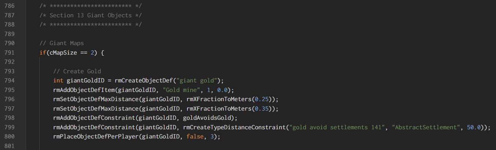

XS Language
===========

Provides language support for the `xs` random map scripts.

### Installation

You can install the plugin by accessing the [XS Language extension](https://marketplace.visualstudio.com/items?itemName=CraicOverflow89.xs-language) in the [market place](https://marketplace.visualstudio.com/vscode), or by using the command pallete.

```
ext install xs-language
```

### Features

Provides syntax highlighting for comments, control structures, quoted strings and boolean / numeric constants.

